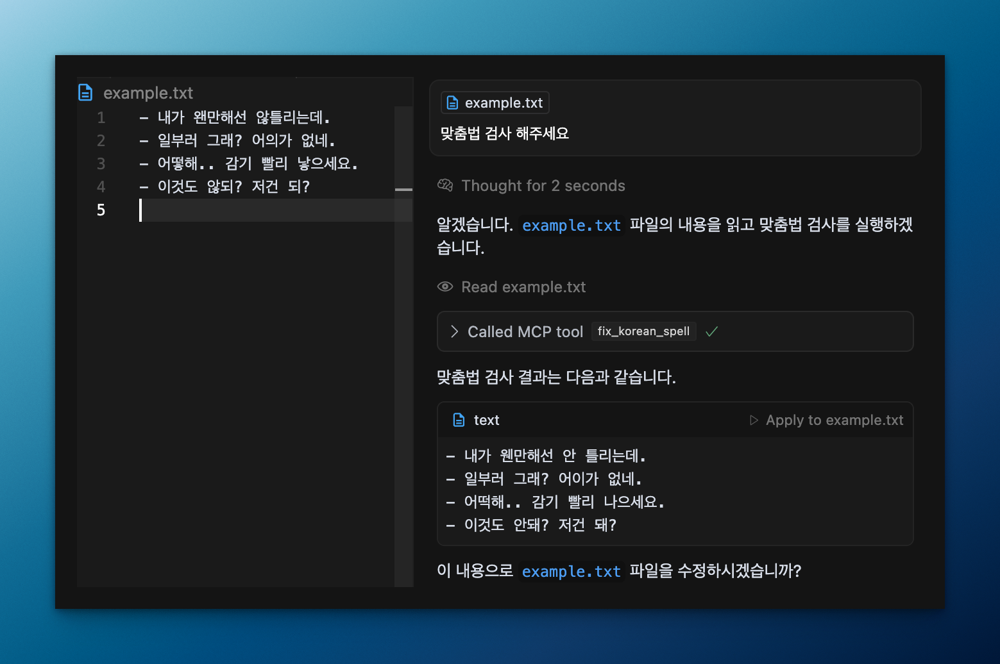

# mcp-korean-spell

`mcp-korean-spell` is a MCP(Model Context Protocol) server designed for Korean spell checking, providing a reliable tool for writers to integrate spell checking capabilities into their documents and texts.



## Tools

- `fix_korean_spell`: Analyzes and corrects Korean text for spelling and grammar errors

## How to add MCP config to your client

### Using npm

To configure this spell checker in your MCP client, add the following to your [`~/.cursor/mcp.json`](cursor://settings/) or `claude_desktop_config.json` (MacOS: `~/Library/Application\ Support/Claude/claude_desktop_config.json`)

```javascript
{
  "mcpServers": {
    "korean-spell-checker": {
      "command": "npx",
      "args": [
        "-y",
        "@winterjung/mcp-korean-spell"
      ]
    }
  }
}
```

## License

This project is licensed under the Apache License 2.0. See the [LICENSE](LICENSE) file for details.
